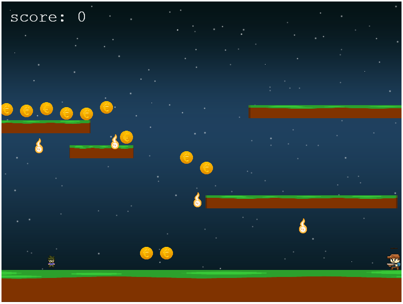

# GETCOINS

# GetCoins (JavaScript)

This project is a game build with javascript, when user can collect coins to get score ,without touching the fire.

## Live Demo

[Link here](https://peaceful-aryabhata-69b861.netlify.app/)

## ScreenShoot




## Built With

- JavaScript
- ESLint
- Phaser 3
- VS Code

### Design Process

GetCoins design process started with the idea of creating a simple and beautiful RPG.  I got inspired by the RPG classic the supermario. and thanks to opengameart.org  for posting all of these amazing spirites and tiels  used in the game.

the game entire map was built with Tiled on a 32 x 32 collection other than the cowboy that was built on 45 x 44   of squares.
first I created player and coins to get scores then I added the fire so the player will have some obstacles to run from.

## Prerequisites

You must have a browser on your PC in order to use the application. [Click here](https://www.mozilla.org/en-US/firefox/new/) to download one.

## Getting Started

1. clone the project

```bash
# Clone this repository
$ git clone https://github.com/rida-elbahtouri/GetCoins.git

# Go into the repository
$ cd GetCoins


```

## for webpack run:

the dependencies needed in this project are:

- webpack
- webpack-cli
- webpack-dev-server

- and Jest for testing

**You can Install the dependencies with this commands**

```bash
$ npm run install

```
### start the game
```bash 
$ npm run start
 # and open the link provided 
```
## Usage

- USE <-  -> to move left and right 
- use up key to jumb
- collect coins without touching the fire

## Authors

👤 **Rida Elbahtouri**

- [Github](https://github.com/rida-elbahtouri)
- [Twitter](https://twitter.com/RElbahtouri)
- [Linkedin](https://www.linkedin.com/in/rida-elbahtouri/)

## 🤝 Contributing

Contributions, issues and feature requests are welcome!

Feel free to check the <a href="https://github.com/rida-elbahtouri/WeatherApp/issues" target="_blank">issues page</a>.

## Show your support

Give a ⭐️ if you like this project!

## Acknowledgments

- <a href="https://www.theodinproject.com/" target="_blank">The Odin Project</a>

- <a href="https://www.opengameart.org" target="_blank">Opengameart</a>
